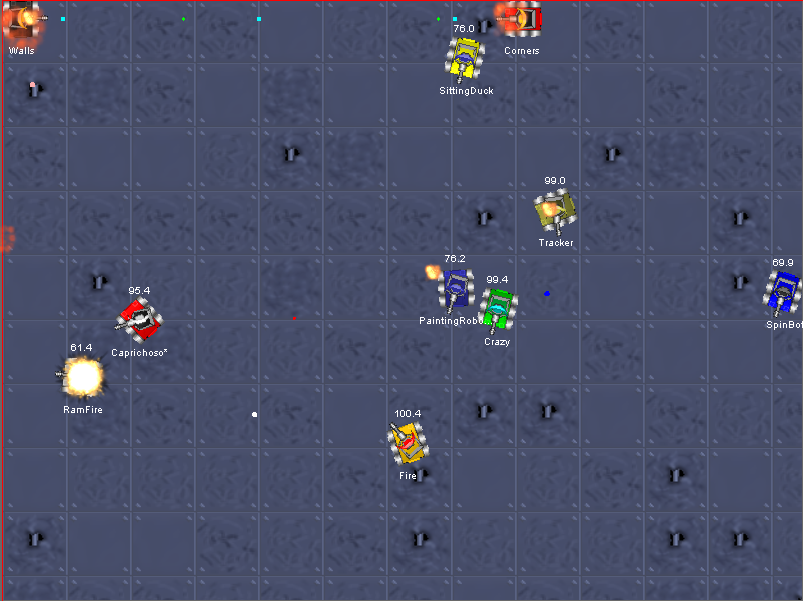
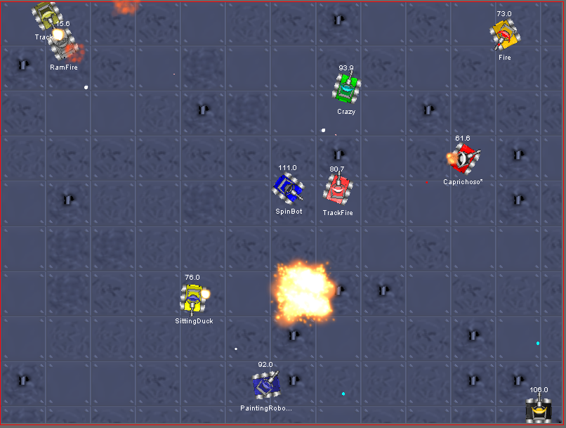
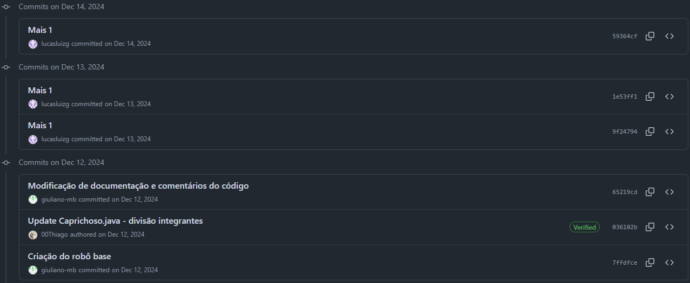
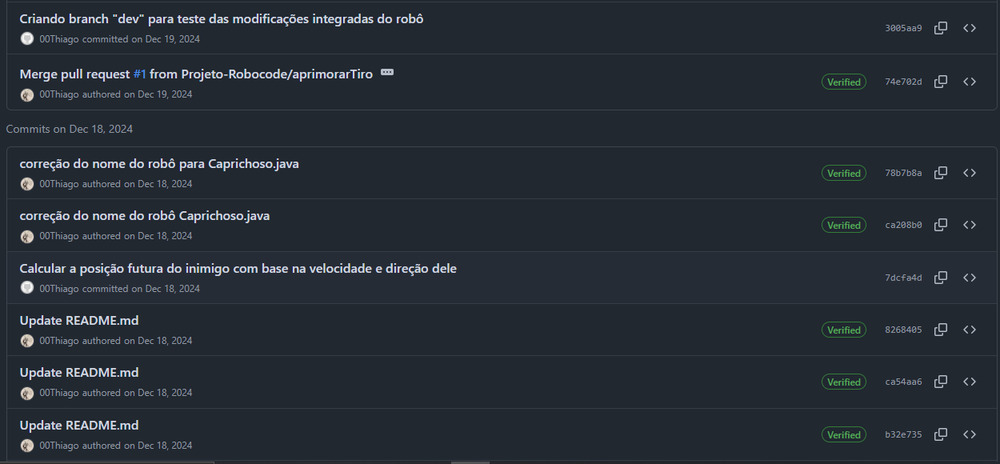
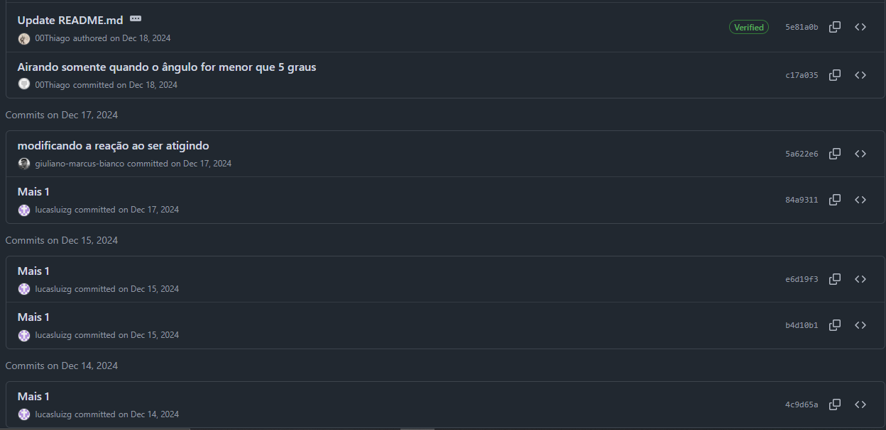
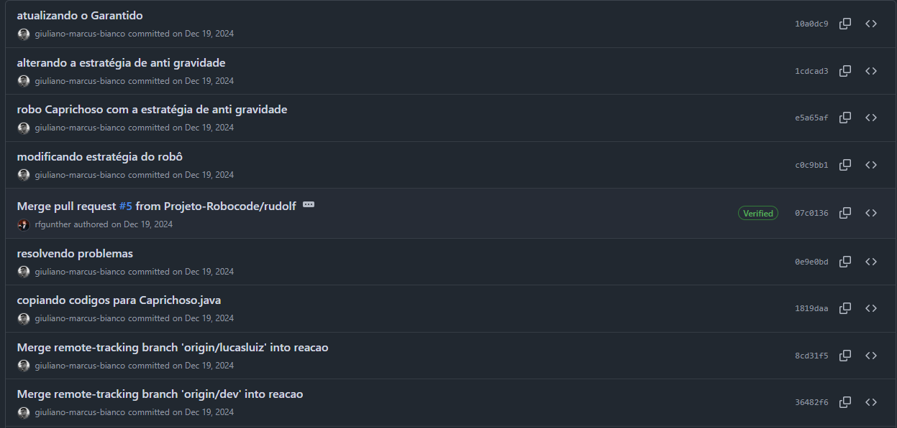
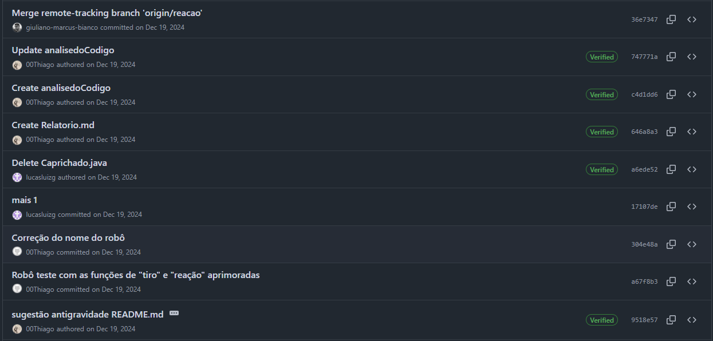
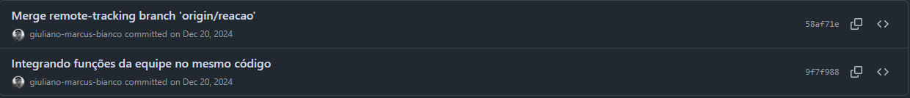

# Trabalho 3 - Git e GitHub no Robocode 🚀

**Professor:** Diego da Silva de Medeiros
**Email:** [diegomedeiros@ifsc.edu.br](mailto:diegomedeiros@ifsc.edu.br)

---

## 1. Introdução 🤖

Nesta atividade, utilizamos o **Robocode**, um jogo no qual construímos robôs simulando tanques de guerra para combater em uma arena virtual. Originalmente criado para ensinar programação em Java, o Robocode expandiu seu escopo e se tornou uma ferramenta para desenvolver habilidades de programação e trabalho em equipe. Contudo, o foco deste trabalho **não foi aprender Java ou construir o melhor robô**, mas sim nos familiarizarmos com o uso de ferramentas de controle de versão, especificamente o **Git** e o **GitHub**.

O controle de versão é essencial no desenvolvimento de software, permitindo que múltiplos desenvolvedores trabalhem em conjunto sem sobrescrever alterações, além de oferecer um histórico detalhado das mudanças. O Git, aliado ao GitHub, se consolidou como a solução ideal para esses desafios, promovendo colaboração e organização no trabalho em equipe.

---

## 2. Objetivos da Atividade 🎯

1. **Aprender a utilizar o Git e o GitHub:** Dominar os comandos básicos (*clone, commit, push, pull, merge*) e compreender a aplicação dos Pull Requests para revisão e integração do código.
2. **Desenvolver habilidades de programação e trabalho colaborativo:** Trabalhar em equipe, distribuindo funções específicas (Radar, Movimento, Tiro e Reação a tiros) para garantir que cada membro contribua de forma individual e integrada.
3. **Implementar o robô “Caprichoso”:** Criar um robô que, mesmo simples e com trechos manuais (apenas aperfeiçoados com Inteligência Artificial pontual), apresenta movimentos imprevisíveis e respostas automáticas aos ataques.
4. **Valorizar a comunicação e a organização:**
   Superar desafios como conflitos de merge e falta de comunicação, essenciais para a execução de um projeto colaborativo de sucesso.

---

## 3. Descrição da Atividade 🛠️

### Desenvolvimento do Robô

A atividade consistiu na criação de um robô no Robocode, chamado **"Caprichoso"**, que foi programado para competir em uma arena virtual. O projeto foi desenvolvido em equipe, com cada membro responsável por uma funcionalidade específica do robô. Focamos em desenvolver uma movimentação imprevisível para diminuir as chances do robô ser atingido, o que, com diversas alterações no código, se tornou um desafio cada vez maior. Apesar da simplicidade do código, grande parte foi desenvolvida manualmente – preservando a ideia original de cada membro – e com pequenas implementações de Inteligência Artificial para aperfeiçoamentos.

### Divisão de Funções

Cada membro foi responsável por uma parte do projeto:

- **Radar:** *Responsável por detectar inimigos* – **Rudolf**
- **Movimentação:** *Responsável por desenvolver movimentos imprevisíveis* – **Lucas**
- **Tiro:** *Responsável por ajustar a lógica e precisão dos disparos* – **Thiago**
- **Reação a tiros recebidos:** *Responsável por programar as respostas automáticas do robô* – **Giuliano**

### Utilização do Git e GitHub

- **Repositório:** Criamos o repositório na organização do GitHub, acessível em [https://github.com/Projeto-Robocode](https://github.com/Projeto-Robocode), garantindo que todos os membros pudessem contribuir de forma ordenada.
- **Branches:** Para organizar o desenvolvimento, criamos diversas branches:

  - **main:** Código base consolidado.
  - **aprimorarTiro:** Focada na melhoria da função de tiro.
  - **lucasluiz:** Dedicada à movimentação imprevisível.
  - **radarmk2:** Voltada para aprimoramento do sistema de detecção (radar).
  - **reacao:** Para implementar a resposta do robô ao ser atingido.

  Outras branches foram criadas para testes iniciais e, posteriormente, descartadas.

---

## 4. Estrutura do Git e Estratégias de Versionamento 🔧

- **Organização do Repositório:** O projeto está hospedado na organização **Projeto-Robocode** no GitHub, o que permitiu a colaboração de todos os membros de forma organizada e eficiente.
- **Divisão em Branches e Fluxo de Trabalho:** Cada branch isolou o desenvolvimento de uma funcionalidade específica, permitindo testes independentes e a integração gradual:

  - **main:** Código estável e base do projeto.
  - **aprimorarTiro:** Focado na lógica de disparos.
  - **lucasluiz:** Voltado para desenvolver a movimentação.
  - **Radar mk2:** Para melhorias no sistema de detecção.
  - **reacao:** Para a resposta aos ataques.
- **Commits e Mensagens Claras:** A realização de **47 commits** com mensagens detalhadas possibilitou o rastreamento preciso das mudanças e facilitou a identificação de erros e a resolução de conflitos.
- **Uso de Pull Requests:**
  Mesmo com a importância dos Pull Requests para a revisão de código, a nossa estrutura colaborativa reduziu, em alguns casos, sua necessidade sem comprometer a qualidade do trabalho.

---

## 5. Resultados e Aprendizados 📈

### Resultados

- O robô **“Caprichoso”** foi desenvolvido com sucesso, apresentando funcionalidades de movimentação, tiro, radar e reação a tiros recebidos.
- O projeto demonstrou a eficácia do trabalho colaborativo e o uso adequado do Git e GitHub para a integração de diversas contribuições individuais.

### Aprendizados

- **Domínio das Ferramentas de Versionamento:** Aprendemos a utilizar comandos essenciais do Git e a importância dos Pull Requests para garantir a qualidade do código.
- **Trabalho em Equipe:** A experiência reforçou que a comunicação, a divisão clara de tarefas e a resolução colaborativa de conflitos são fundamentais para o sucesso de um projeto.
- **Desafios Superados:** Enfrentamos dificuldades iniciais com conflitos de merge e a organização das tarefas, que foram superadas com prática, paciência e a correta aplicação dos dispositivos de versionamento.
- **Integração de Técnicas:** Apesar de o código ter sido desenvolvido de forma manual para preservar a criatividade individual, a integração de trechos de Inteligência Artificial para aperfeiçoamentos demonstrou a capacidade de combinar diferentes técnicas para melhorar o produto final.
- **Valorização do Aspecto Humano:**
  A experiência evidenciou que, além das habilidades técnicas (hard skills), as soft skills – comunicação, colaboração e tato social – são fundamentais para o sucesso em ambientes de desenvolvimento.

---

## 6. Conclusão 🏁

Esta atividade foi extremamente valiosa para o aprendizado do controle de versão e do trabalho colaborativo. Ao utilizar o Git e o GitHub, conseguimos desenvolver o robô **“Caprichoso”** no Robocode, aplicando conceitos de programação e integração de funcionalidades em equipe. Mesmo com desafios como conflitos de merge e dificuldades iniciais, o projeto foi concluído com sucesso, e os aprendizados obtidos serão essenciais para futuros projetos no desenvolvimento de software.

---

## 7. Anexos 📎

### Imagens do Robô "Caprichoso" em Ação

### Imagens dos Commits

---

## Referências 🔗

- **Repositório GitHub:** [https://github.com/Projeto-Robocode/robocode](https://github.com/Projeto-Robocode/robocode)
- **Histórico de Commits:** [https://github.com/Projeto-Robocode/robocode/commits/](https://github.com/Projeto-Robocode/robocode/commits/)

---
